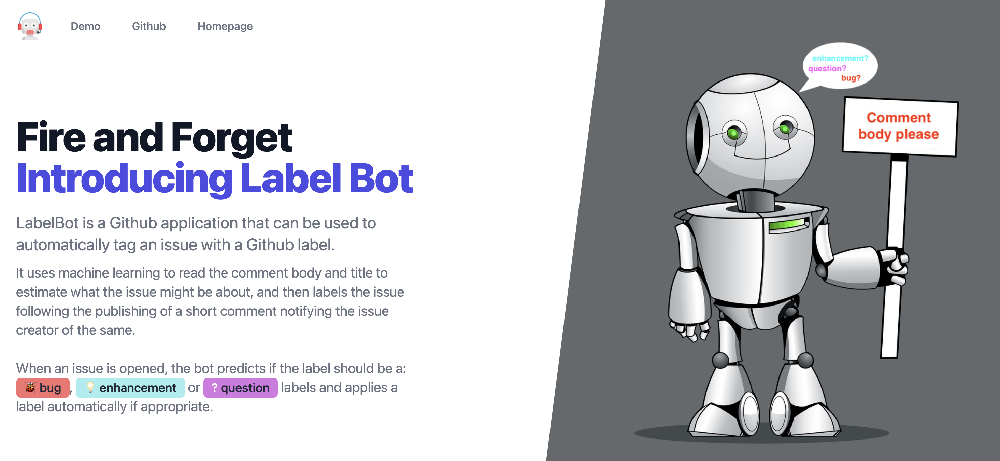

# Website for Label Predicton Github Bot
[](https://app.netlify.com/sites/labelling-bot/deploys)

# Setup

```bash
# Install dependencies
yarn install or npm install

# Run for development build
yarn build:dev or npm run build:dev # generate main.css for development
yarn start or npm run start # starts web server and watches for file changes

# Run for production build
yarn build # if using npm, change 'yarn build:prod' to 'npm run build:prod' in package.json
```

### Website screenshot


[Video of Label Prediction on website](assets/label_prediction.mp4)